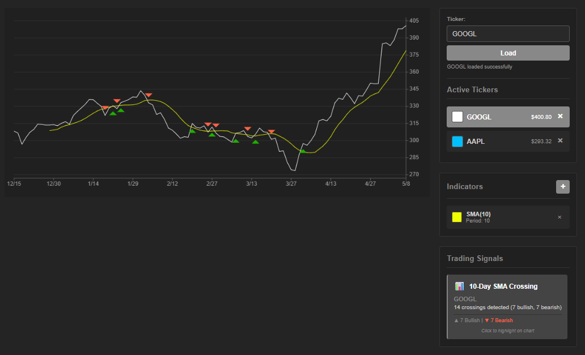

# Wilhelm Charts

An open-source JavaScript charting API tailored for stock analysis, built from scratch using Canvas API.



*Main interface showing stock chart with technical indicators, ticker list, and trading signals*

## Overview

Wilhelm Charts is a modular, lightweight charting library designed specifically for financial data visualization. Built without external dependencies (except for data fetching), it provides a clean, extensible architecture for stock market analysis.

## Features

- **Real-time stock data** - Yahoo Finance integration via proxy server
- **Interactive charts** - Mouse hover with crosshair and data tooltips
- **Customizable colors** - Color picker for each ticker's chart line with localStorage persistence
- **Date-based X-axis** - Automatic date formatting and labeling
- **Dynamic Y-axis** - Auto-scaling based on price ranges
- **Grid system** - Configurable horizontal grid lines
- **Technical indicators** - Modal-based configuration with customizable parameters
  - Simple Moving Average (SMA) with multiple instances support
  - Persistent storage using localStorage
  - More indicators coming soon
- **Trading signals** - Automated signal detection and visualization
  - 10-day SMA crossing detection (bullish/bearish)
  - Click to highlight signal points on chart with colored triangles
  - Full time series analysis
- **Ticker management** - Multi-ticker sidebar with localStorage persistence
  - Add/remove tickers with delete button
  - Color customization per ticker
  - Automatic price updates
- **Modular architecture** - Separate modules for chart, search, indicators, signals, and ticker list
- **Dark theme** - Optimized for financial trading interfaces with gray accent colors

## Project Structure

```
app/
├── chart/                  # Chart rendering module
├── ticker-list/            # Active tickers sidebar with search
├── stock-broker/           # Yahoo Finance data fetcher
├── indicators/             # Technical indicators (SMA, EMA, etc.)
├── indicators-panel/       # Indicators UI with modal configuration
├── signals/                # Trading signals detection and display
└── index.html/css/js       # Main application
chart-api/                  # Core chart components
├── chart-config.js         # Configuration and scaling
├── line-config.js          # Line styling
├── axis.js                 # Axis rendering
├── draw-grid.js            # Grid lines
├── draw-chart.js           # Main drawing orchestration
├── draw-line.js            # Line drawing helper
└── mouse-action.js         # Mouse interactions
proxy-server.js             # CORS proxy for Yahoo Finance
package.json
```

## Quick Start

1. Install dependencies:
```bash
npm install
```

2. Start the proxy server:
```bash
npm start
```

3. Open in browser:
```
http://localhost:3000/app/index.html
```

## Current Status

**Working:**
- Stock data fetching from Yahoo Finance
- Line chart rendering with dates
- Mouse hover interactions with crosshair
- Multiple ticker tracking in sidebar with customizable colors
- Ticker persistence across page refreshes with localStorage
- Delete tickers with X button
- Integrated search within ticker panel
- Dynamic Y-axis scaling
- **Technical Indicators:**
  - Simple Moving Average (SMA) with configurable period and color
  - Modal-based indicator configuration
  - Multiple instances of same indicator with different parameters
  - Visual indicator management panel
  - LocalStorage persistence - Indicators saved across page refreshes
- **Trading Signals:**
  - 10-day SMA crossing detection (bullish/bearish)
  - Full time series analysis for all crossings
  - Click-to-highlight feature with triangle markers on chart
  - Toggle on/off visualization

**In Development:**
- Additional trading signals (RSI overbought/oversold, MACD crossovers)
- Additional indicators (EMA, RSI, MACD, Bollinger Bands, Volume, Stochastic)
- Candlestick charts
- Drawing tools (trendlines, support/resistance)
- Time period selectors
- Multiple timeframes

## Objective

Develop a production-ready, open-source charting library that rivals commercial solutions like TradingView, with a focus on:
- Performance and responsiveness
- Extensibility for custom indicators
- Clean, maintainable codebase
- Zero external charting dependencies

## License

MIT License - see [LICENSE](LICENSE) file for details
